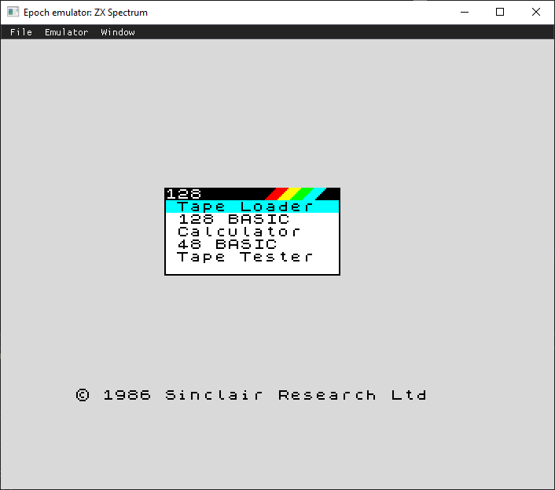
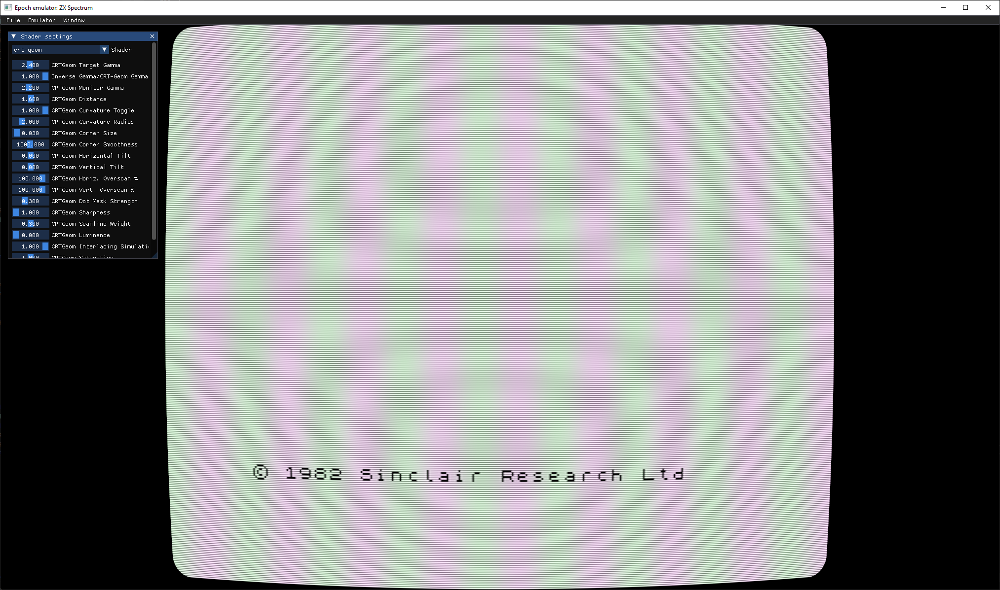

# Epoch: ZX Spectrum emulator


This is a cross-platform ZX Spectrum 48K/128K/+2/+3 emulator written, for the fun of it, from scratch in C++.

## Features
- Instruction level Z80 emulation: all instructions passes zexdoc and zexall
- Load/Save snapshots (.sna, partial .z80)
- Tape loading (.tap, .tzx)
- Sound
- Drag&drop file loading
- Kempston joystick emulation (arrows and right-control for fire)
- ZX 48K/128K/+2/+2A/+3 spectrum
- AY sound chip

## Roadmap
- Contended memory
- Tape UX
- .z80 snapshots
- Fast loading
- Emulation speed controls
- Tape saving
- Debugging UX (memory, registers)
- Disassembler

## Screenshots




Configurable output shader:



## Building

This project uses CMake 3.22. All dependencies are loaded using CMake `FetchContent`.

Builds on Windows (Visual Studio 2022), GNU/Linux (Ubuntu 22.04) and MacOS (12.6.7).

### Windows

* Install Visual Studio 2022 with CMake and C workload
* Open the folder with Visual Studio
* Build!

### Ubuntu 22.04 build

```bash
# Build tools
sudo apt install build-essential cmake ninja-build

# Requisites
sudo apt install libasound-dev libdbus-1-dev libwayland-dev libxkbcommon-dev wayland-protocols xorg-dev
```

Build commands:

```bash
mkdir build && cd build
cmake .. -DCMAKE_BUILD_TYPE=Release
make
```

## License
Copyright &copy; 2024 Andrea Ghidini.

Epoch is [free software](https://www.gnu.org/philosophy/free-sw.html): you can redistribute it and/or modify
it under the terms of the [GNU General Public License](https://www.gnu.org/licenses/gpl-3.0.html) as published by
the [Free Software Foundation](https://www.fsf.org), either version 3 of the License, or
(at your option) any later version.

Epoch is distributed in the hope that it will be useful, but **WITHOUT ANY WARRANTY; without even the implied warranty of MERCHANTABILITY or FITNESS FOR A PARTICULAR PURPOSE**.
See the GNU General Public License for more details.

You should have received a [copy](LICENSE) of the GNU General Public License along with Epoch.
If not, see https://www.gnu.org/licenses/.

## Used libraries
* [Dear ImGui](https://github.com/ocornut/imgui) for the GUI
* [GLFW](https://www.glfw.org/) for graphics and input
* [ImGuiFileDialog](https://github.com/aiekick/ImGuiFileDialog) for file dialog
* [PortAudio](http://www.portaudio.com/) for audio
